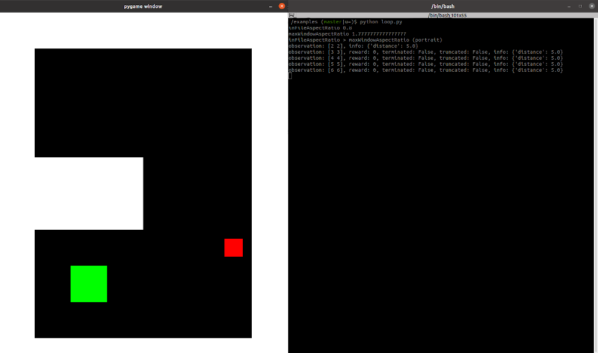

# gymnasium-playground/gridworld



## Installation

```bash
pip install -e .
```

## Run

```bash
cd examples
python render.py  # render example
python loop.py  # loop example
python q-learning.py  # q-learning example
```

## Uninstall (linux)

Check if installed or not via `pip list`. Find the `__pycache__` directories via `find -name "__pycache__"`.

```bash
rm -rf gymnasium_csv.egg-info
rm -rf ./gymnasium_csv/envs/__pycache__ ./gymnasium_csv/wrappers/__pycache__ ./gymnasium_csv/__pycache__
```
